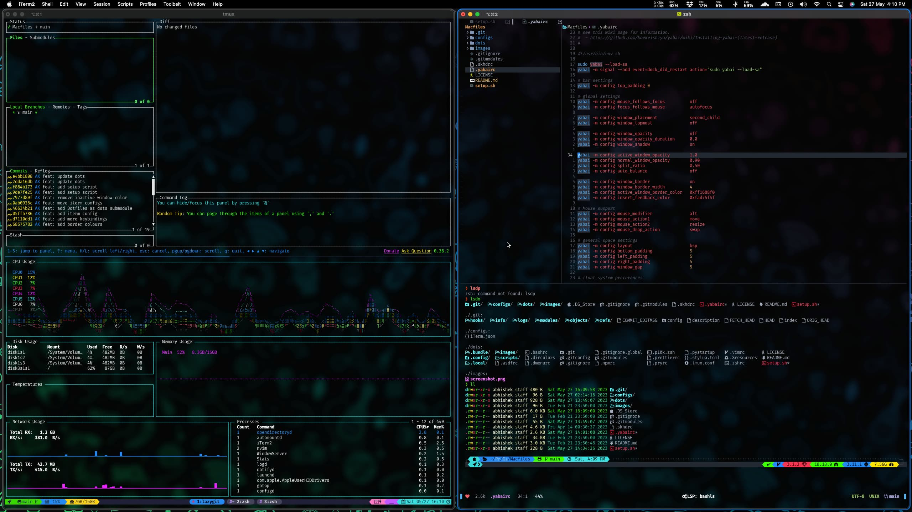

<div align = "center">

<h1><a href="https://github.com/2kabhishek/mac2k">mac2k</a></h1>

<a href="https://github.com/2KAbhishek/mac2k/blob/main/LICENSE">
 </a>

<a href="https://github.com/2KAbhishek/mac2k/graphs/contributors">
 </a>

<a href="https://github.com/2KAbhishek/mac2k/stargazers">
</a>

<a href="https://github.com/2KAbhishek/mac2k/network/members">
 </a>

<a href="https://github.com/2KAbhishek/mac2k/watchers">
 </a>

<a href="https://github.com/2KAbhishek/mac2k/pulse">
 </a>

<h3>Ultimate Dev Setup for Mac OS 🚀🍎</h3>

<figure>
  
  <br/>
  <figcaption>mac2k in action</figcaption>
</figure>

</div>

mac2k is a set of handcrafted configs for setting up a complete dev environment on Mac OS.

It makes developing on Mac much more pleasant for CLI lovers.

## ✨ Features

- Sets up a complete dev environment within minutes
- Sets up brew and installs essential packages with Brewfile
- Configures optimal settings for developers
- All the power and tools provider by [dots2k](https://github.com/2kabhishek/dots2k)
- Powerful personalized editing with [nvim2k](https://github.com/2kabhishek/nvim2k)
- Keyboard driven browsing support with [qute2k](https://github.com/2kabhishek/qute2k)
- Tiling window management with [Aerospace](https://github.com/nikitabobko/AeroSpace)
- More!!

## Setup

### 🚀 Installation

```bash
git clone https://github.com/2kabhishek/mac2k
cd mac2k

./setup.sh
```

This will install all necessary packages, symlinks and setup symlinks for you.

To manually run steps from [dots2k setup](./dots2k/setup.sh) you can run `./dots2k/setup.sh`

### 💻 Usage

#### Keybindings

I also set up some keybindings manually:

> Cmd = ⌘/Windows/Super, Option = ⌥/Alt, Control = ⌃/Ctrl, Function = fn

##### System Keybindings

- Remap <kbd>Caps Lock</kbd> to <kbd>Esc</kbd>
- Swap <kbd>Fn</kbd> and <kbd>Ctrl</kbd>

##### Raycast Keybindings

- <kbd>Cmd</kbd> Shortcuts:

  - <kbd>Space</kbd> open Raycast
  - <kbd>[</kbd> open Alacritty
  - <kbd>]</kbd> open Qutebrowser
  - <kbd>'</kbd> open Arc Browser
  - <kbd>;</kbd> open Raycast Camera
  - <kbd>.</kbd> open Emoji Picker
  - <kbd>i</kbd> open System Preferences

- <kbd>Option</kbd> Shortcuts:
  - <kbd>Space</kbd> open Menu items search
  - <kbd>v</kbd> open Clipboard History

##### Arc Keybindings

- <kbd>Option</kbd> Shortcuts:
  - <kbd>\\</kbd> Add Split
  - <kbd>`</kbd> Open Console
  - <kbd>1..8</kbd> Sidebar item 1 to 8
  - <kbd>9</kbd> Last Sidebar item
  - <kbd>Shift+1..8</kbd> Switch to space 1 to 8
  - <kbd>Shift+C</kbd> Portrait Screenshot
  - <kbd>Shift+D</kbd> Toggle developer mode
  - <kbd>Shift+F</kbd> Full Page Screenshot
  - <kbd>Shift+H/Shift+L</kbd> Previous / Next space
  - <kbd>Shift+I</kbd> View Source
  - <kbd>Shift+N</kbd> Add new space
  - <kbd>Shift+O</kbd> Manage spaces
  - <kbd>Shift+P</kbd> New incognito window
  - <kbd>Shift+R</kbd> Clear cookies and refresh
  - <kbd>Shift+Y</kbd> Copy URL as Markdown
  - <kbd>Shift+W</kbd> Show Archived Tabs
  - <kbd>Shift+Z</kbd> Move Little Arc to Space
  - <kbd>a</kbd> View downloads
  - <kbd>b</kbd> Duplicate Tab
  - <kbd>c</kbd> Portrait Screenshot
  - <kbd>d</kbd> Developer Tools
  - <kbd>e</kbd> Toggle sidebar
  - <kbd>f</kbd> Find in page
  - <kbd>g</kbd> Open Library
  - <kbd>h/l</kbd> Previous/Next Tab
  - <kbd>i</kbd> Inspect elements
  - <kbd>j,] / k,[</kbd> Go forward / backward
  - <kbd>m</kbd> ChatGPT message
  - <kbd>n</kbd> New window
  - <kbd>o</kbd> Command bar
  - <kbd>p</kbd> Pin / Unpin tab
  - <kbd>r</kbd> History
  - <kbd>s</kbd> Separate tab from split
  - <kbd>t</kbd> New tab
  - <kbd>u</kbd> Undo close tab
  - <kbd>w</kbd> Archive taab
  - <kbd>x</kbd> Close split pane
  - <kbd>y</kbd> Copy URL
  - <kbd>z</kbd> Little Arc Window

More browser keybindings configured with [Vimium](./dots2k/config/vimium.json), Qutebrowser uses [qute2k](https://github.com/2kabhishek/qute2k) for keybindings.

#### Aliases

This also comes with a bunch of mac aliases in [./dots2k/.config/shell/aliases.sh](./dots2k/.config/shell/aliases.sh) to make your life easier.

- `aerr`, `aert` for aeropace reload config and toggle
- `bri`, `brr`, `brc`, `brs`, `bru` to brew install, uninstall, cleanup, search, update respectively
- `macdis` to disable mac's internal display, useful when using external display, needs restart to re-enable

#### Other Configs

For most tools I'm symlinking configs over from [dots2k](https://github.com/2kabhishek/dots2k).

##### Setting up iTerm

> I use Alacritty as my default terminal now

Run iTerm and open "Preferences", Go to "Profiles" tab and click on "Other Actions" and then click on "Import JSON Profiles"

Select the [./configs/iterm/preofile.json](./configs/profile.json) file and import it.

You can also use the [helper script](./config/iterm/iterm) to open iterm from terminal by symlinking it to your path and running `iterm`.

##### Tiling Window Management

> I use [Aerospace](./config/aerospace/aerospace.toml) as my tiling window manager now

`yabai` and `skhd` together provide a tiling window management system for MacOS.

```bash
# Symlink yabai and skhd configs
ln -sfn "$PWD/config/.yabairc" "$HOME/"
ln -sfn "$PWD/config/.skhdrc" "$HOME/"

# Start yabai and skhd
yabai --start-service
skhd --start-service

# Add alias to restart yabai and skhd
alias macres="yabai --restart-service && skhd --restart-service"
```

## Behind The Code

### 🌈 Inspiration

I am a big fan of CLI and Tiling WMs, MacOS by default doesn't provide a good solution for those, so I decided to configure my own.

### 💡 Challenges/Learnings

- Some hiccups with brew and services
- Learned and implemented recursive git submodules

### 🧰 Tooling

- [dots2k](https://github.com/2kabhishek/dots2k) — Personalized Dev Environment
- [nvim2k](https://github.com/2kabhishek/nvim2k) — Personalized Editor

<hr>

<div align="center">

<strong>⭐ hit the star button if you found this useful ⭐</strong><br>

<a href="https://github.com/2KAbhishek/mac2k">Source</a>
| <a href="https://2kabhishek.github.io/blog" target="_blank">Blog </a>
| <a href="https://twitter.com/2kabhishek" target="_blank">Twitter </a>
| <a href="https://linkedin.com/in/2kabhishek" target="_blank">LinkedIn </a>
| <a href="https://2kabhishek.github.io/links" target="_blank">More Links </a>
| <a href="https://2kabhishek.github.io/projects" target="_blank">Other Projects </a>

</div>
